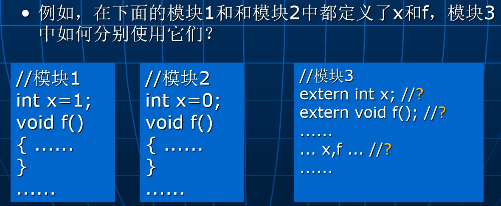
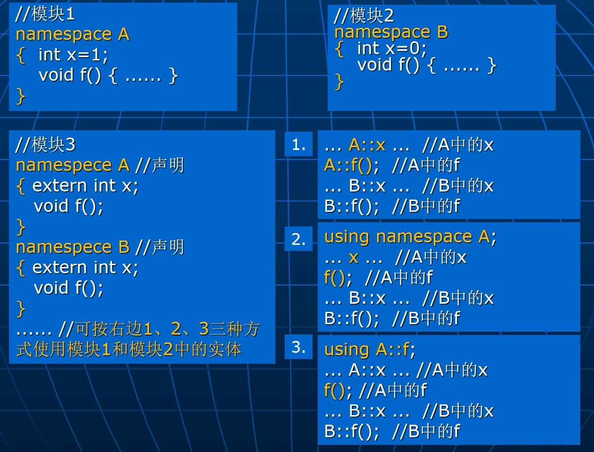

# Lec1 C++语言概述
## C++与C的关系
C++包含了C的所有成分,在C的基础上增加了一些新的语言机制
## C++对C的基本扩充
* 局部变量的定义位置：允许局部变量的定义可以夹插在语句中
* 常量定义：
```c
#define PI 3.1416
```
C的做法，编译预处理命令
```cpp
const double PI=3.1416;
```
C++的做法，便于编译时进行类型检查
* 表示条件的表达式:
值非0表示满足，0表示不满足（C的做法）
bool类型：true表示满足，false表示不满足（C++扩充的，便于理解）
* 内联（inline）函数
* 名空间（namespace）
* 标准库
* 动态变量的内存分配
* 引用类型
* 函数名重载
* 类型自动判断auto
* 结构化异常处理
* 类型安全的输入输出

### 类型安全的输入输出
假设现在有变量x,y:
```c
int x;
double y;
```
c语言的输入输出：
```c
#include <stdio.h>
scanf("%d%lf",&x,&y);//类型不安全
printf("%d,%lf\n",x,y);//类型不安全
```
C++的输入输出：
```cpp
#include <iostream>
using namespace std;

cin>>x>>y;
cout<<x<<y;
//自动判断输入数据的类型和个数。
	   //cin为特殊类型的变量（对象），“>>”为重载的操作符
	   //cout为特殊类型的变量（对象），“<<”为重载的操作符
```
### 解决对小函数调用的低效问题
函数调用是需要额外开销的：
* 保留返回地址
* 为局部变量和形参分配空间
* 实现参数传递
* 返回时，归还空间、根据返回地址返回调用点
对一些函数体只包含一两条语句的**小函数**，函数调用的额外开销往往大于完成函数功能所需要的开销，它会使得频繁地调用这样函数的程序效率不高！
C++提供了两种解决上述问题的办法：
* 带参数的宏定义（C已有的）
* **内联函数**（C++扩充的）
#### 带参数的宏定义
带参数的宏定义是一种**编译预处理命令**，它可以实现类似函数的功能。
```c
#define max(a,b) ((a)>(b)?(a):(b))
```
在**编译之前**，编译预处理程序将对程序中宏的使用进行**文字替换**,然后交给编译程序进行编译。
例如，编译预处理程序将把程序中的
```cpp
cout << max(a,b);
```
替换成：
```cpp
cout << (((a)>(b))?(a):(b));
```
然后进行编译
**带参数的宏定义的缺点：**
1. 需要加上很多的括号，否则会出问题。
```c
#define max(x,y) x>y?x:y 
10+max(a,b)+c //将被替换成：
//10+a>b?a:b+c
//编译程序认为是：(10+a)>b?a:(b+c)
```
2. 有时会出现重复计算。
```c
max(a+1,b*2) 将被替换成：
//a+1>b*2?a+1:b*2
//a+1或b*2要计算2次
```
3. 不能进行类型检查和转换。
4. 不利于一些工具（如调试）对程序的处理。例如，在上面程序的编译结果中，max已不存在。

#### 内联函数
内联函数是指在定义函数时，在函数返回类型之前加上一个关键词**inline**。
```cpp
inline int max(int x, int y)
{	return x>y?x:y;
}
```
内联函数的调用与普通函数的调用形式相同：
```cpp
int z=max(a,b);
```
内联函数的作用是**建议**编译程序把该函数的函数体展开到调用点，函数调用时直接执行函数体。
之所以是“建议”，是因为有些函数不适合展开，如递归函数，编译程序会忽略inline要求，按普通函数处理。

### 带缺省值的形式参数
在C++中允许在声明函数时，为函数的某些参数指定默认值。
```cpp
void print(int value, int base=10);
```
在对这些函数调用的地方，如果没有提供相应的实参，则相应的形参采用指定的默认值。
```cpp
print(32,2); //32传给value；2传给base
print(28); //28传给value；10传给base， 是默认值
```
指定函数参数默认值时的几点注意：
- 有默认值的形参应全处于形参表的右部。
```cpp
void f(int a, int b=1, int c); //Error，c没指定默认值
```
- 在不同的源文件中，对同一个函数的声明可以对它的参数指定不同的默认值。
- 在同一个源文件中，对同一个函数的声明只能对它的每一个参数指定一次默认值。

### 名空间作用域
对于一个由多个模块（源文件）构成的程序，有时会面临一个问题：
在一个模块中要用到在另外两个模块中定义的不同全局程序实体，而这两个全局程序实体的名字相同。

C++提供了**名空间**（namespace）机制来解决上述的名冲突问题： 
可以把全局标识符定义在一个名空间中，其作用域为该名空间。
当在一个名空间外部需要使用该名空间中定义的全局标识符时，需要用该名空间的名字来修饰或受限。
下面是一个使用名空间的例子：


**注意**：由于C++标准库中的全局实体（如cin、cout）是定义在名空间std中的，因此，使用标准库中的全局实体时要用std受限。
```cpp
using namespace std;
```

具有文件作用域的标识符可以用**无名的名空间**来定义。
例如，对于下面用static说明的具有文件作用域的全局变量：
```c
static int x,y; //C语言的做法
```
可以改写成：
```cpp
namespace
	{  int x,y; //x和y只能在本源文件中使用！
	}
```
**注意**：C++中，static有两个作用：
- 指定全局标识符具有文件作用域（可用无名的名空间替代）
- 指定局部变量具有静态生存期

### 动态变量
动态变量是指在程序运行中，由程序根据需要额外创建的变量，主要用于表示**元素个数可变**的复合数据，如链表、树等。
**注意**：动态变量没有名字，需要通过指向它的**指针变量**来标识和访问。
**在C语言中**，动态变量是用**库函数**来创建和撤销的。例如：
```c
int *p1; //p1是个指针变量, 创建一个int型动态变量，p1指向之
p1 = (int *)malloc(sizeof(int));
int *p2; //p2是个指针变量,创建一个由n个int型元素构成的动态数组，p2指向其第一个元素
p2 = (int *)calloc(n,sizeof(int)); //元素初始化为0
free(p1);
free(p2);
```
**在C++语言中**，增加了创建和撤销动态变量的两个操作符**new**和**delete**，提高类型安全性。
```cpp
int *p1; //p1是个指针变量
p1 = new int; //C++扩充，空间大小自动确定
int *p2; //p2是个指针变量
p2 = new int[n]; //C++扩充
delete p1;
delete []p2; //由于p2指向的是一个数组，所以要加[]
```
一般来说，
用new创建的动态变量需要用delete来撤销
用malloc（calloc）创建的动态变量则需要用free撤销

**注意**：对于普通的动态变量，C++与C的做法区别不大，但如果创建的是**动态对象**，则两者是有差别的：
除了为对象分配空间外，new还会去调用对象类的**构造函数**进行对象初始化， malloc（calloc）则否。
除了收回为对象分配的空间外，delete还会去调用对象类的**析构函数**进行对象消亡后的清理工作，free则否。

### 程序实体在内存中的安排
程序运行时，程序中的实体将存储在四个区域中：
**静态数据区**：用于**全局变量**、**static**存储类的局部变量以及一些常量的内存分配 。
**代码区**：用于存放程序的指令，对C++程序而言，代码区存放的是**所有函数代码**。
**栈区**：用于自动存储类的局部变量、函数的形式参数以及函数调用时有关信息（如：函数返回地址等）的内存分配。采用栈结构管理
**堆区**：用于**动态变量**的内存分配。常采用堆结构管理。

### C/C++动态变量存在的问题
C++没有**自动废区收集功能**，如果用原始的指针来标识和访问动态变量，往往需要程序显式地用**free**或**delete**来撤销它们，否则会出现**内存泄漏问题**

### 引用类型
引用类型是用来给一个变量取一个别名，通过该别名可以访问原来的变量。
```cpp
int x;
int &y=x; //y为引用类型的变量，它是x的别名
y = 10;  //通过y访问x，效果上等价于：x = 10;
cout << x; //输出10
```
引用类型具有指针类型的一些效果，但语法不一样。引用主要用于函数的参数类型，实现指针类型参数的效果，但它比指针类型抽象和安全。
例如，用引用类型提高函数参数传递的效率：
```cpp
struct A
{ int i;
   ......
};
void f(A &x) //x使用实参a的内存空间，提高参数传递效率
{ ......
   … x.i … //访问的是实参a
   ......
}
int main()
{ A a;
   ......
   f(a); //把a传给函数f
   ......
}
```